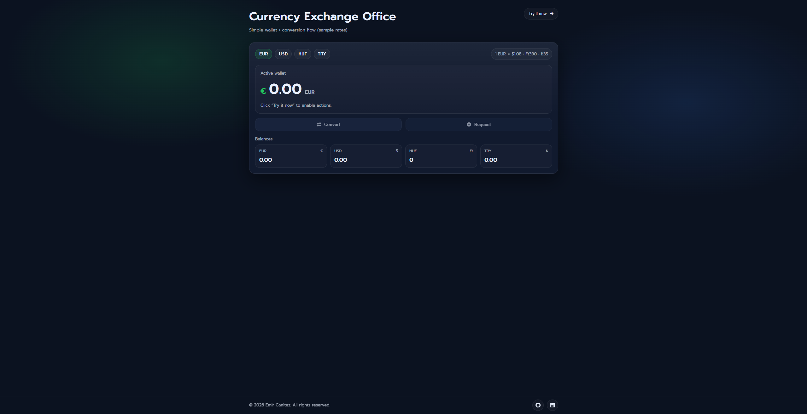
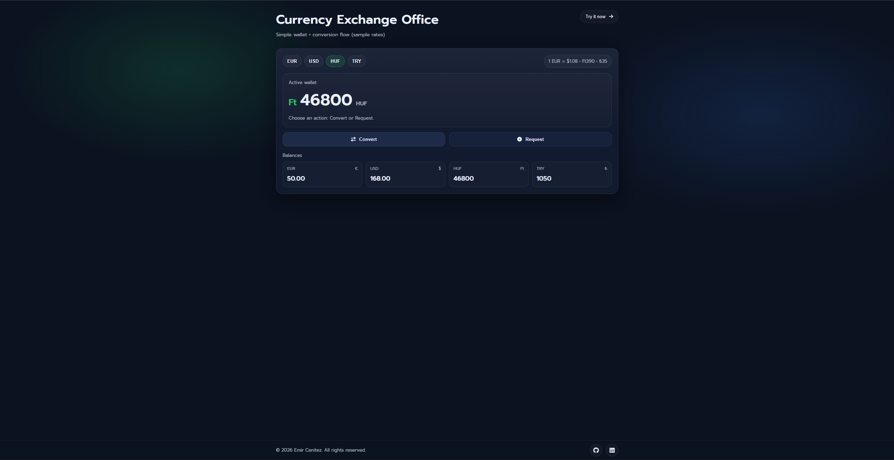
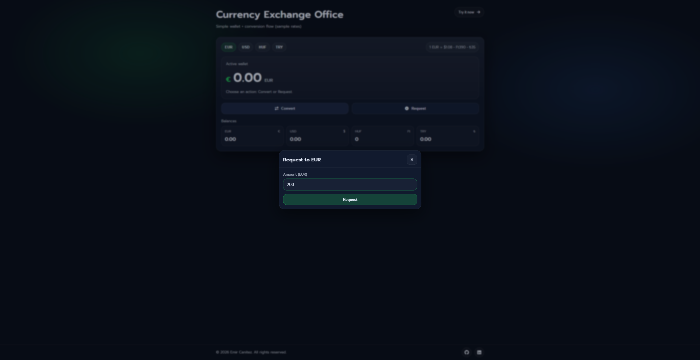
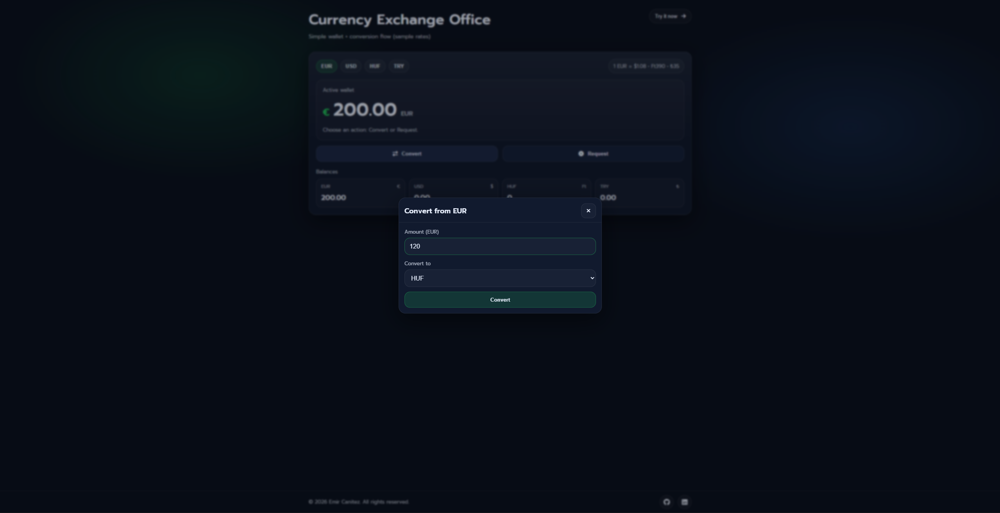

# JavaScript Exchange (Vanilla JS)

A lightweight currency exchange practice app with **wallet balances**, a **base-currency conversion model**, and a **refactored UI** focused on clean structure and predictable behavior.

**Why this repo exists:** It showcases my progression from early prototypes to a more production-minded approach (state management, validation, UI consistency, and maintainability).

---

## Live Demo
- Demo: https://cntzemir.github.io/javascript-exchange/

---

## Screenshots

### Quick Preview
<table>
  <tr>
    <td align="center"><b>Dashboard</b></td>
    <td align="center"><b>Example Exchange</b></td>
  </tr>
  <tr>
    <td></td>
    <td></td>
  </tr>
</table>

<details>
  <summary><b>More screenshots</b></summary>
  <br/>
  <table>
    <tr>
      <td align="center"><b>Request Money</b></td>
      <td align="center"><b>Convert Flow</b></td>
    </tr>
    <tr>
      <td></td>
      <td></td>
    </tr>
  </table>
</details>

---

## Key Features

### Product-like UI
- Wallet balances overview (dashboard-style)
- Single modal component with **mode switching** (Convert / Request)
- Inline error feedback (no disruptive `alert()` UX)

### Conversion Logic
- Base-currency model (rates defined relative to a base)
- Single conversion function (testable and scalable)
- Prevents “if/else combination explosion”

### Validation & Edge Cases
- Input validation (amount, currency selections)
- Clear error messages inside the modal
- Predictable behavior on invalid actions

### Keyboard Shortcuts
- `Enter` → submit (when modal is open)
- `Esc` → close modal

---

## Tech Stack
- HTML
- CSS
- JavaScript (Vanilla)

---

## Project Structure
```text
.
├─ index.html
├─ assets/
│  ├─ css/
│  │  └─ style.css
│  └─ js/
│     └─ app.js
├─ docs/
│  └─ screenshots/
├─ CHANGELOG.md
├─ LICENSE
└─ README.md
